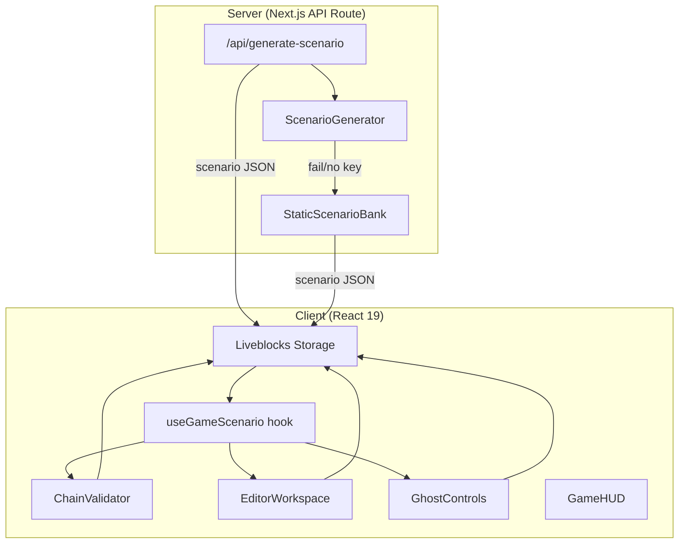

# Design Document: Interconnected System Tasks

## Overview

This design replaces the current independent bug-fix task system with an interconnected 3-file scenario model. Instead of 8 isolated tasks across 2 static sets, each game session presents a cohesive broken system where 3 files form a dependency chain — bugs cascade, fix order matters, and validation runs against the whole system.

The LLM (Gemini 3 Flash Preview) generates the entire scenario in a single prompt: narrative, 3 files with bugs/fixes, a dependency graph, and test cases. A static fallback bank provides reliability when LLM generation fails. The Chain Validator runs tests in dependency order, reporting per-file and system-wide status. Ghost sabotage abilities are adapted to exploit the dependency chain (e.g., Inject Bug cascades invalidation to dependent files).

Key changes from the current system:

- **3 files instead of 8 tasks**: Each file is a meaningful unit in a connected system
- **Dependency graph**: Stage 1 → Stage 2 → Stage 3 linear chain (DAG)
- **Chain validation**: Tests run in dependency order; blocked files are skipped
- **System status**: Aggregate health indicator replaces per-task checkmarks
- **Single LLM prompt**: One call generates the full scenario (vs. 3 parallel stage calls today)
- **Static scenarios**: Pre-authored interconnected scenarios replace the current 2-set task bank

## Architecture



The architecture follows the existing pattern: a server-side API route generates data, stores it in Liveblocks, and client components read from Liveblocks via hooks. The new `ChainValidator` module is the main addition — it orchestrates dependency-aware test execution using the existing `runTests` function from `testRunner.ts`.

### Data Flow

1. Host clicks "Start Game" → Lobby calls `POST /api/generate-scenario`
2. Server: `ScenarioGenerator` sends prompt to Gemini → validates response → returns scenario JSON (or falls back to `StaticScenarioBank`)
3. Lobby stores scenario in Liveblocks `generatedScenario` storage field
4. All clients read scenario via `useGameScenario` hook
5. Engineers edit files → changes sync via Liveblocks `editorContent`
6. Engineer clicks "Verify System" → `ChainValidator` runs tests in dependency order → updates `fileVerification` and `systemStatus` in Liveblocks
7. All 3 files pass → `gameStatus` set to `"engineers-win"`

## Components and Interfaces

### 1. ScenarioGenerator (`src/lib/scenarioGenerator.ts`)

Replaces the current `taskGenerator.ts` stage-by-stage approach with a single-prompt scenario generator.

```typescript
interface Scenario {
  description: string; // Narrative shown to players
  files: ScenarioFile[]; // Exactly 3 files
  dependencyGraph: DependencyGraph;
}

interface ScenarioFile {
  id: string; // e.g., "file-auth-service"
  fileName: string; // e.g., "authService.ts"
  label: string; // e.g., "Auth Service"
  description: string; // What this file does / what's broken
  buggyCode: string;
  fixedCode: string;
  stage: 1 | 2 | 3;
  testCases: TestCase[]; // At least 2 per file
}

interface TestCase {
  description: string;
  assertion: string; // JS expression returning boolean
  crossFile?: boolean; // Whether this test validates cross-file deps
}

interface DependencyGraph {
  [fileId: string]: string[]; // fileId → array of fileIds it depends on
}

// Main entry point
async function generateScenario(apiKey: string): Promise<Scenario>;

// Validation
function validateScenarioResponse(raw: unknown): Scenario | null;
function validateScenarioTests(scenario: Scenario): boolean;
```

**Key differences from current `taskGenerator.ts`:**

- Single prompt instead of 3 parallel stage prompts
- Returns a `Scenario` object with dependency graph instead of flat `Task[]`
- Validates cross-file test cases
- Validates DAG structure (no cycles)

### 2. StaticScenarioBank (`src/lib/staticScenarioBank.ts`)

Replaces `taskBank.ts` with pre-authored interconnected scenarios.

```typescript
// Select scenario deterministically by room code
function getStaticScenario(roomCode: string): Scenario;

// At least 2 pre-authored scenarios
const SCENARIOS: Scenario[];
```

### 3. ChainValidator (`src/lib/chainValidator.ts`)

New module. Runs tests in dependency order using the existing `runTests` from `testRunner.ts`.

```typescript
type FileStatus = "passed" | "failed" | "blocked" | "pending";
type SystemStatus = "operational" | "degraded";

interface ChainValidationResult {
  fileResults: Record<
    string,
    {
      status: FileStatus;
      blockedBy?: string; // fileId that blocked this file
      testResult?: RunResult; // from testRunner.ts
    }
  >;
  systemStatus: SystemStatus;
}

function validateChain(
  scenario: Scenario,
  editorContent: Record<string, string>,
  currentVerification: Record<string, boolean>,
): ChainValidationResult;

// Invalidation: given a changed fileId, return all fileIds that need re-verification
function getInvalidationCascade(
  fileId: string,
  dependencyGraph: DependencyGraph,
): string[];
```

### 4. useGameScenario hook (`src/lib/useGameScenario.ts`)

Replaces `useGameTasks.ts`. Single source of truth for scenario data.

```typescript
interface UseGameScenarioReturn {
  scenario: Scenario | null;
  files: ScenarioFile[];
  dependencyGraph: DependencyGraph;
  isGenerated: boolean;
  scenarioLabel: string;
  getUnlockedFiles: (elapsed: number) => ScenarioFile[];
  getCurrentStage: (elapsed: number) => 1 | 2 | 3;
}

function useGameScenario(roomCode: string): UseGameScenarioReturn;
```

### 5. API Route (`src/app/api/generate-scenario/route.ts`)

Replaces `/api/generate-tasks`. Single endpoint for scenario generation.

```typescript
// POST /api/generate-scenario
// Body: { roomCode: string }
// Response: { scenario: Scenario, generated: boolean, reason?: string }
```

### 6. Updated EditorWorkspace

The existing `EditorWorkspace` and `GameEditor` components are updated to:

- Display scenario narrative banner
- Show 3 files with dependency indicators in sidebar
- Show per-file verification status (passed/failed/blocked)
- Show system status indicator
- Add "Verify System" button that triggers chain validation
- Visually indicate stage unlocks

### 7. Updated GhostControls

The existing `GhostControls` component is updated:

- **Inject Bug**: Reverts file to buggyCode + invalidates that file AND all dependents
- **Fake Fix**: Makes file appear verified for 15s (ghost sees true status)
- **Blackout/Phantom Cursor**: Unchanged behavior

### 8. Updated Liveblocks Storage

```typescript
// New/changed fields in Liveblocks Storage
interface Storage {
  // ... existing fields ...

  // Replaces generatedTasks
  generatedScenario: Scenario | null;

  // Replaces verifiedTasks — now includes status detail
  fileVerification: Record<
    string,
    {
      verified: boolean;
      status: FileStatus;
    }
  >;

  // New: system-wide status
  systemStatus: "operational" | "degraded";
}
```

## Data Models

### Scenario (core domain model)

```typescript
interface Scenario {
  description: string;
  files: ScenarioFile[];
  dependencyGraph: DependencyGraph;
}
```

The dependency graph is a simple adjacency list. For 3 files in a linear chain:

```json
{
  "file-1": [],
  "file-2": ["file-1"],
  "file-3": ["file-2"]
}
```

Stage values map directly to dependency depth: stage 1 has no dependencies, stage 2 depends on stage 1, stage 3 depends on stage 2.

### ScenarioFile

```typescript
interface ScenarioFile {
  id: string;
  fileName: string;
  label: string;
  description: string;
  buggyCode: string;
  fixedCode: string;
  stage: 1 | 2 | 3;
  testCases: TestCase[];
}
```

Each file is 10–30 lines of TypeScript/JavaScript with no external imports. Test cases are self-contained JS expressions. Cross-file test cases reference functions from multiple files and are attached to the dependent file.

### TestCase

```typescript
interface TestCase {
  description: string;
  assertion: string;
  crossFile?: boolean;
}
```

Cross-file assertions are evaluated with all dependency files' code prepended. For example, a stage 3 cross-file test would have stage 1 + stage 2 code prepended before the assertion runs.

### ChainValidationResult

```typescript
interface ChainValidationResult {
  fileResults: Record<
    string,
    {
      status: "passed" | "failed" | "blocked" | "pending";
      blockedBy?: string;
      testResult?: RunResult;
    }
  >;
  systemStatus: "operational" | "degraded";
}
```

`systemStatus` is `"operational"` only when all 3 files have `status: "passed"`.

### Liveblocks Storage Schema Changes

Current storage fields that change:

- `generatedTasks` → `generatedScenario: Scenario | null`
- `verifiedTasks: Record<string, boolean>` → `fileVerification: Record<string, { verified: boolean; status: FileStatus }>`
- New: `systemStatus: "operational" | "degraded"`
- `editorContent: Record<string, string>` — unchanged, now keyed by ScenarioFile ID

### Stage Timing (unchanged)

| Stage | Unlock Time | Duration |
| ----- | ----------- | -------- |
| 1     | 0:00        | 1:30     |
| 2     | 1:30        | 1:30     |
| 3     | 3:00        | 1:00     |

Total game duration: 4 minutes (240 seconds).

## Correctness Properties

_A property is a characteristic or behavior that should hold true across all valid executions of a system — essentially, a formal statement about what the system should do. Properties serve as the bridge between human-readable specifications and machine-verifiable correctness guarantees._

### Property 1: Scenario validation rejects invalid structures

_For any_ JSON object purporting to be a Scenario, the `validateScenarioResponse` function SHALL accept it if and only if it contains a non-empty description string, exactly 3 file objects each with distinct non-empty buggyCode and fixedCode, each file having at least 2 test cases, and a dependencyGraph that forms a valid DAG with no cycles.

**Validates: Requirements 1.3, 7.2**

### Property 2: Stage values are consistent with dependency depth

_For any_ valid Scenario, the stage value of each ScenarioFile SHALL equal its depth in the dependency graph plus one: stage 1 files have no dependencies, stage 2 files depend only on stage 1 files, and stage 3 files depend only on stage 2 files.

**Validates: Requirements 1.2**

### Property 3: Test validation distinguishes fixed from buggy code

_For any_ valid Scenario where all files have correct test cases, running each file's test cases against its fixedCode SHALL produce all-passing results, and running each file's test cases against its buggyCode SHALL produce at least one failure.

**Validates: Requirements 1.4**

### Property 4: Static scenario selection is deterministic

_For any_ room code string, calling `getStaticScenario` twice with the same room code SHALL return deeply equal Scenario objects.

**Validates: Requirements 2.2**

### Property 5: Chain validation executes in dependency order

_For any_ valid Scenario and editor content, the `validateChain` function SHALL evaluate files in topological order of the dependency graph — a file's tests are never run before the tests of all its dependencies.

**Validates: Requirements 4.1**

### Property 6: Unverified dependencies block dependent files

_For any_ valid Scenario where at least one file's tests fail, all files that transitively depend on the failing file SHALL have status "blocked" in the ChainValidationResult, and their tests SHALL not be executed.

**Validates: Requirements 4.2**

### Property 7: Editing a file cascades invalidation to all dependents

_For any_ valid Scenario with a set of verified files, when a verified file's editor content changes, `getInvalidationCascade` SHALL return that file's ID and the IDs of all files that transitively depend on it in the dependency graph.

**Validates: Requirements 4.6, 6.1**

### Property 8: Stage unlock is monotonic with elapsed time

_For any_ elapsed time value between 0 and 240 seconds, `getUnlockedFiles` SHALL return only files whose stage is at or below the current stage threshold (stage 1 for 0–89s, stages 1–2 for 90–179s, stages 1–3 for 180s+), and increasing elapsed time SHALL never decrease the set of unlocked files.

**Validates: Requirements 5.4**

### Property 9: Scenario files are within line count bounds

_For any_ valid Scenario that passes `validateScenarioResponse`, every ScenarioFile's buggyCode and fixedCode SHALL contain between 10 and 30 lines (inclusive).

**Validates: Requirements 7.3**

## Error Handling

### LLM Generation Failures

| Error                                              | Handling                                              |
| -------------------------------------------------- | ----------------------------------------------------- |
| `GEMINI_API_KEY` not set                           | Skip LLM call entirely, return static scenario        |
| LLM API timeout/network error                      | Retry up to 2 times, then fall back to static         |
| LLM returns invalid JSON                           | Reject, retry up to 2 times, then fall back to static |
| LLM returns valid JSON but fails schema validation | Reject, retry, fall back                              |
| LLM returns valid schema but fixedCode fails tests | Reject, retry, fall back                              |
| All retries exhausted                              | Return static scenario with `generated: false`        |

### Chain Validation Errors

| Error                                        | Handling                                                |
| -------------------------------------------- | ------------------------------------------------------- |
| Test assertion throws an exception           | Mark that test as failed, continue with remaining tests |
| Test assertion returns non-boolean           | Mark as failed with descriptive error                   |
| Infinite loop in test code                   | Existing `runTests` timeout guard catches this          |
| Cross-file test with missing dependency code | Mark as blocked (dependency not verified)               |

### Runtime Errors

| Error                                | Handling                                               |
| ------------------------------------ | ------------------------------------------------------ |
| Liveblocks storage write fails       | Liveblocks SDK handles retries internally              |
| Scenario data missing from storage   | `useGameScenario` returns null, UI shows loading state |
| Editor content missing for a file    | Fall back to file's `buggyCode` as initial content     |
| Game timer expires during validation | Timer takes precedence — ghost wins                    |

## Testing Strategy

### Property-Based Tests

Property-based testing is appropriate for this feature because the core logic involves pure functions with clear input/output behavior: scenario validation, chain validation, dependency graph traversal, and stage unlock logic. These functions operate on structured data (scenarios, graphs, editor content) where input variation reveals edge cases.

**Library**: [fast-check](https://github.com/dubzzz/fast-check) for TypeScript property-based testing.

**Configuration**: Minimum 100 iterations per property test.

**Tag format**: `Feature: interconnected-system-tasks, Property {N}: {title}`

Each of the 9 correctness properties above maps to a single property-based test:

1. **Scenario validation** — Generate random JSON objects (valid and invalid scenarios) and verify the validator accepts/rejects correctly
2. **Stage-dependency consistency** — Generate random valid dependency graphs and verify stage assignment
3. **Test validation** — Generate scenarios with known-passing and known-failing code/test pairs
4. **Deterministic selection** — Generate random room code strings and verify idempotent selection
5. **Dependency-order execution** — Generate random DAGs and verify topological execution order
6. **Dependency blocking** — Generate scenarios with various pass/fail file combinations
7. **Cascading invalidation** — Generate dependency graphs with verified file sets, simulate edits
8. **Stage unlock monotonicity** — Generate random elapsed time values and verify unlock sets
9. **Line count bounds** — Generate valid scenarios and verify file line counts

### Unit Tests (Example-Based)

Unit tests cover specific examples, edge cases, and integration points:

- Static scenario bank contains at least 2 valid scenarios (2.1)
- Static scenarios conform to the same schema as LLM scenarios (2.3)
- Scenario narrative description is present and non-empty (1.5)
- No API key → static fallback without LLM call (1.7)
- All files pass → engineers-win (4.4, 8.1)
- Timer expires with incomplete verification → ghost-wins (8.2)
- Paranoia 100 → ghost-wins (8.3)
- Fake Fix shows verified to engineers, true status to ghost (6.2)
- Blackout broadcasts 5-second event (6.3)
- Phantom Cursor uses real player name/color (6.4)
- Breadcrumb fires on each ability use (6.5)

### Integration Tests

- LLM API call with mocked Gemini returns valid scenario
- Retry logic: 2 retries then fallback on LLM failure
- Liveblocks storage correctly stores and syncs scenario data
- End-to-end: generate scenario → store → validate chain → win condition
